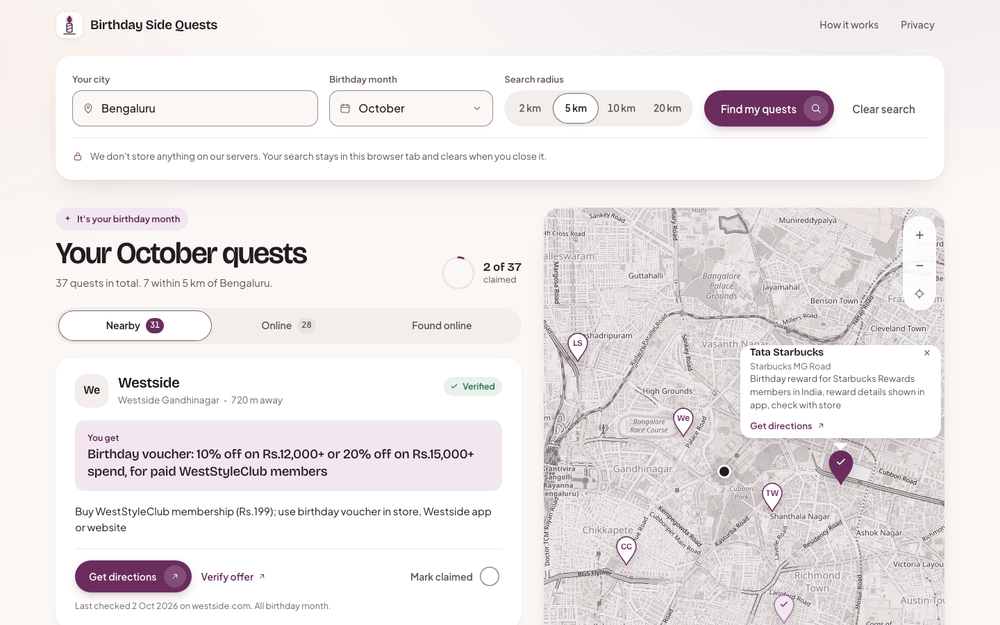
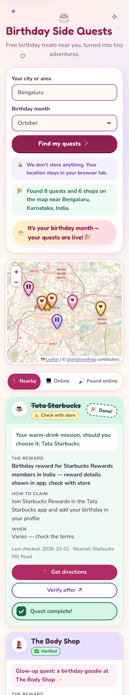
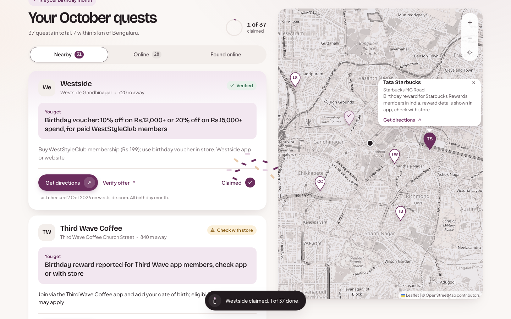

# Birthday Side Quests

> Free birthday treats near you, turned into tiny adventures.

**Live:** https://raksharakyan.github.io/birthday-side-quests/

Type in your city and pick your birthday month. You get a map and a list of birthday side quests: cafés, dessert shops, beauty brands, fashion stores and experiences near you that give birthday freebies or discounts, each with exactly what you get and how to claim it. Online-only deals have their own tab, covering every country.



| Mobile | Claimed |
|---|---|
|  |  |

## Features
- **City search for any city in the world.** Suggestions appear as you type (Photon, OpenStreetMap data).
- **Nearby quests.** Branches of 100+ brands with birthday programs, within a radius you choose (2, 5, 10 or 20 km), sorted nearest first on a Leaflet map.
- **Detailed quest cards.** Each card shows:
  - **You get:** the exact reward where the brand publishes it.
  - **Numbered claim steps.**
  - **Chips:** no purchase needed, minimum spend, join N days before, valid dates, and what to bring.
  - **Badges and dates:** Verified, Check with store or May be outdated, plus the date it was last checked.
  - **Get directions:** opens Google Maps with no API key.
  - **Verify offer:** links to the brand's official page.
- **Claim and celebrate.** Mark a quest claimed. A progress ring fills and the candle logo lights up.
- **Online tab.** App and e-commerce birthday deals for every country. It switches automatically to your city's country.
- **Survives a refresh.** Your search is kept in this browser tab only and clears when you close it.
- **Found online tab (optional).** Live web results via a Cloudflare Worker, clearly labelled *unverified*.
- **Accessible.** Mobile-first, WCAG AA, keyboard navigable, screen-reader labels, respects `prefers-reduced-motion`.

## Privacy, briefly
We don't store anything on our servers. Your search stays in this browser tab and clears when you close it (one small `sessionStorage` record, removable with **Clear search**). There are no accounts, cookies, analytics, localStorage or IndexedDB, and no geolocation prompt. See [PRIVACY.md](PRIVACY.md).

## Where offers come from
Offer facts come **only** from [`public/offers.json`](public/offers.json). Every entry was researched by reading the brand's official rewards or terms page ([research notes](docs/OFFER_RESEARCH.md)), and each one records its `sourceUrl` and `lastVerified` date. If we couldn't confirm an offer from an official page, it shows **"Check with store"**. Entries older than 6 months show a **"May be outdated"** badge. A weekly GitHub Action checks every `sourceUrl` and opens an issue when a link breaks. AI is never used as a source of offer facts.

## Tech
Vite + vanilla TypeScript, Leaflet + OpenStreetMap tiles, Nominatim (geocoding), Overpass API (branches), and an optional Cloudflare Worker + Tavily for "Found online". Fonts are self-hosted with Fontsource. There are only three runtime dependencies. The design system is documented in [DESIGN.md](DESIGN.md).

## Local setup
You need Node 22 or later.

```bash
git clone https://github.com/raksharakyan/birthday-side-quests.git
cd birthday-side-quests
npm ci
npm run dev            # http://localhost:5173/birthday-side-quests/
```

| Command | What it does |
|---|---|
| `npm run build` | Typechecks the app, configs and Worker, then builds `dist/` |
| `npm test` | Unit tests (Vitest), including the Worker |
| `npx playwright install chromium && npm run test:e2e` | E2E on desktop and mobile, with all network calls mocked |
| `npm run lhci` | Lighthouse CI (Performance ≥ 90, Accessibility ≥ 95, Best Practices ≥ 95) |
| `npm run audit` | `npm audit --audit-level=high` |

Copy `.env.example` to `.env.local` to set `VITE_BASE` or `VITE_WORKER_URL`.

## Deploy
- **Site.** Pushing to `main` runs [`ci-deploy.yml`](.github/workflows/ci-deploy.yml): audit → typecheck → unit tests → build → Playwright → Lighthouse → deploy to GitHub Pages. In repo settings, Pages must be set to **Source: GitHub Actions**.
- **Found online Worker (optional).** Follow [worker/README.md](worker/README.md): `wrangler login`, then `wrangler secret put TAVILY_API_KEY`, then `wrangler deploy`. Then set the repo **variable** `VITE_WORKER_URL` to the Worker's https URL and re-run the workflow. Until you do, the tab stays hidden.
- **Cloudflare Pages alternative.** [`public/_headers`](public/_headers) adds the full security headers that GitHub Pages can't send.

## Adding a new offer
1. Find the brand's **official** rewards or T&C page. Blogs and coupon sites don't count.
2. Add an entry to [`public/offers.json`](public/offers.json):
   ```json
   {
     "id": "brand-in",
     "brand": "Brand",
     "category": "cafe",
     "offer": "Free birthday drink for app members",
     "howToClaim": "Join the app and add your birthday at least 7 days before",
     "countries": ["IN"],
     "channel": "in-store",
     "claimWindow": "day",
     "sourceUrl": "https://brand.example/rewards",
     "lastVerified": "2026-10-02",
     "verified": true,
     "osm": { "wikidata": "Q123", "nameRegex": "brand" }
   }
   ```
   - `category`: `cafe | dessert | restaurant | beauty | fashion | retail | online`
   - `channel`: `in-store | online | both`
   - `claimWindow`: `day | week | month | varies`
   - `countries`: ISO-2 codes, or `["*"]`
   - `osm` is optional. Use `wikidata` for the brand's `brand:wikidata` tag; `nameRegex` allows only letters, digits, spaces and `'’&.-|()?^$`.
   - `venues` is optional and is for single-location destinations (theme parks, water parks): 1 to 20 `{ "name", "lat", "lng", "exact"? }`. The offer shows in Nearby only when a venue is within 150 km of the searched city. Use `"exact": false` for approximate coordinates (no map pin, directions by name). Use `venues` instead of `osm` and set `channel` to `in-store`.
3. Run `npm test`. The schema test rejects non-https URLs, unknown categories, overlong text and hidden Unicode tricks.
4. Open a PR. See [CONTRIBUTING.md](CONTRIBUTING.md).

## Docs
[CLAUDE.md](CLAUDE.md) · [DESIGN.md](DESIGN.md) · [SECURITY.md](SECURITY.md) · [PRIVACY.md](PRIVACY.md) · [CONTRIBUTING.md](CONTRIBUTING.md) · [docs/PLAN.md](docs/PLAN.md) · [docs/DECISIONS.md](docs/DECISIONS.md) · [docs/HANDOFFS.md](docs/HANDOFFS.md)

## Credits
Map data © [OpenStreetMap contributors](https://www.openstreetmap.org/copyright). Geocoding by Nominatim, branch search by the Overpass API. Please be kind to these free services.

## License
[MIT](LICENSE) © 2026 raksharakyan
